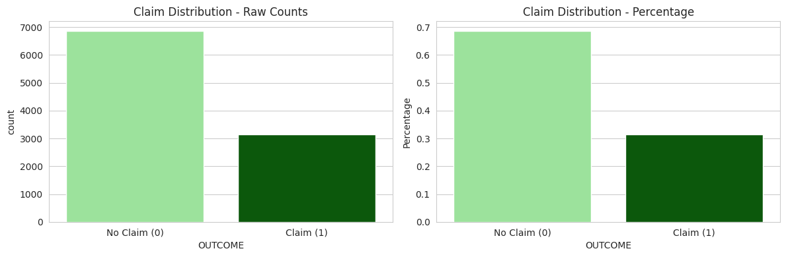
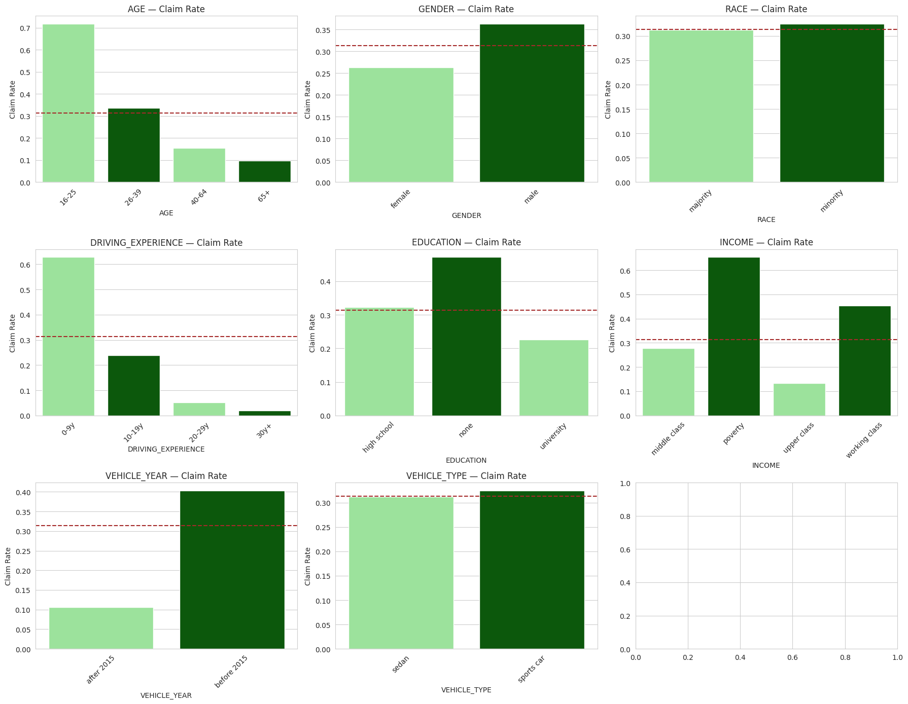
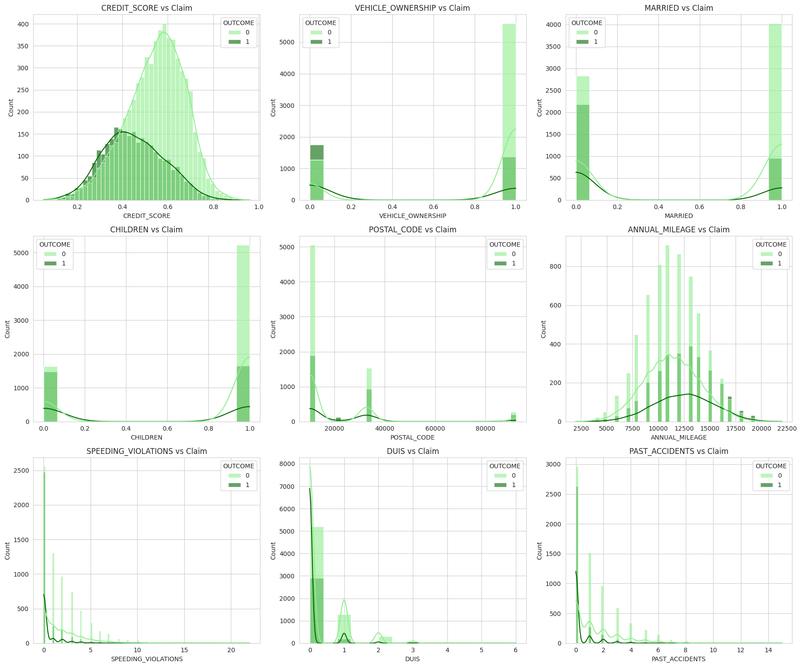
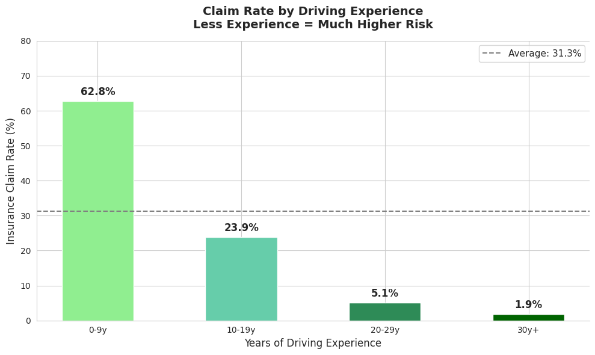
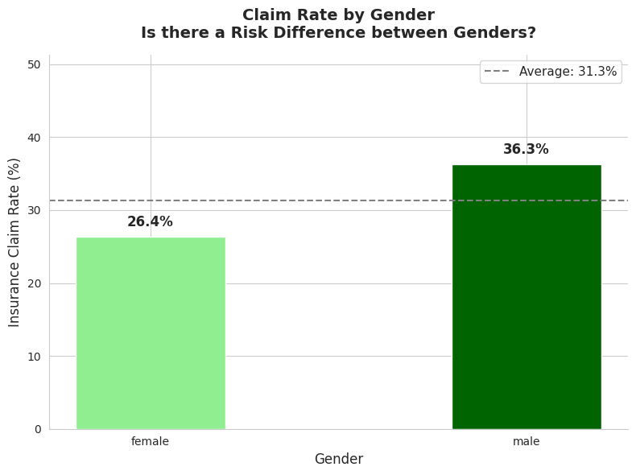
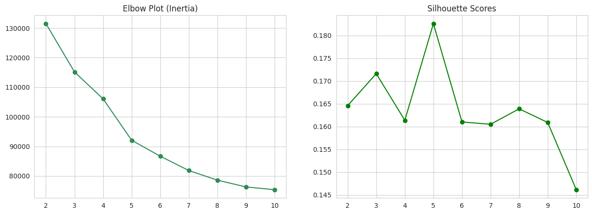
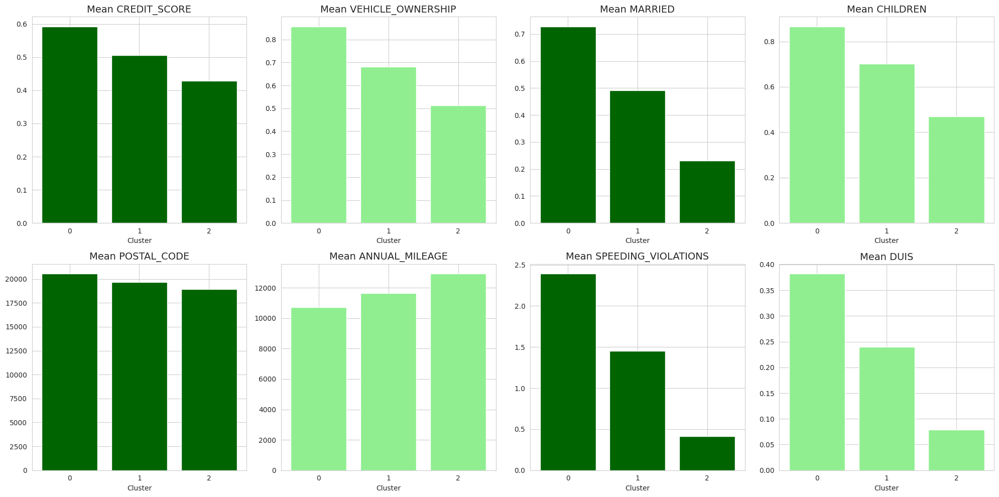
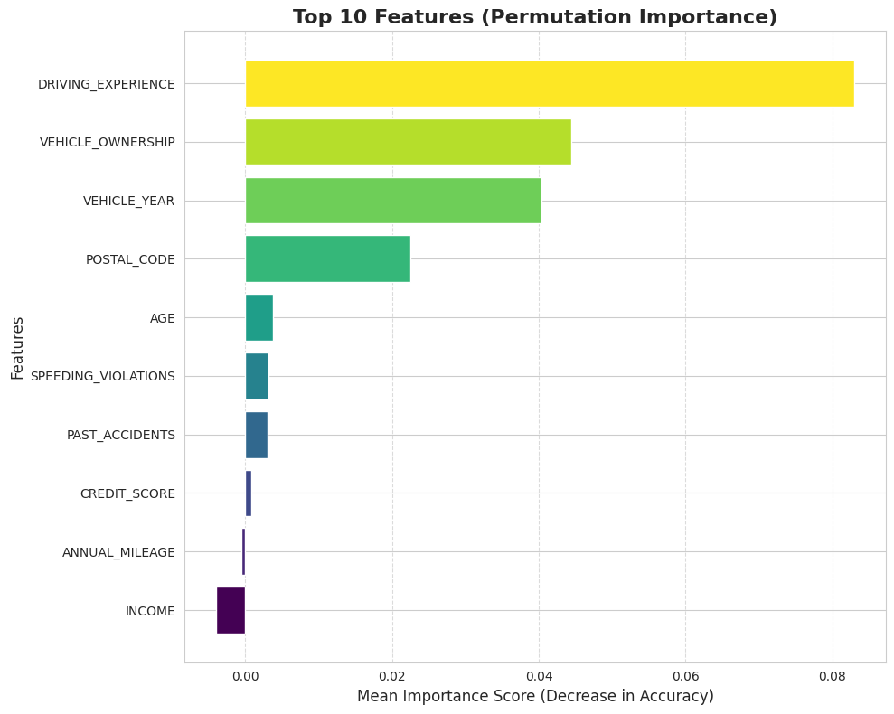

# 🚗 Car Insurance Claims Prediction


---

## 🔍 Problem Statement

Car insurance companies face significant financial risk when customers file unexpected claims.
Accurate prediction of claim likelihood enables smarter premium pricing and better risk management.

> **Goal:** Build a machine learning model that predicts whether a customer will file a car insurance claim —
> enabling insurers to identify high-risk customers **before** losses occur.

---

## 🎯 Target Variable

| Value | Meaning |
|-------|---------|
| `0` | Customer did NOT file a claim ✅ |
| `1` | Customer filed a claim ❌ |

**Claim Rate in Dataset: 31.33%**

---

## 📊 Dataset Overview

| Property | Value |
|----------|-------|
| Rows | 10,000 customers |
| Features | 18 input features + 1 target |
| Task | Binary Classification |

### Key Features

| Feature | What it Represents | Business Impact |
|---------|-------------------|----------------|
| `DRIVING_EXPERIENCE` | Years of driving | Primary risk indicator |
| `VEHICLE_OWNERSHIP` | Owner vs Non-owner | Financial stability & asset care |
| `VEHICLE_YEAR` | Car's age | Modern cars have better safety tech |
| `POSTAL_CODE` | Driving location | High-traffic areas increase risk |
| `AGE` | Driver's age | Maturity directly affects risk-taking |
| `SPEEDING_VIOLATIONS` | Traffic tickets | Direct measure of aggressive driving |
| `PAST_ACCIDENTS` | Accident history | Best predictor for future claims |
| `CREDIT_SCORE` | Financial score | Linked to responsibility |
| `ANNUAL_MILEAGE` | Yearly distance | More road time = higher exposure |
| `INCOME` | Annual salary | Socioeconomic context |

---

## ⚙️ Methodology — 3 Stage Pipeline

```
Part 1: Base Model
Data Loading → EDA → Cleaning → Preprocessing → Random Forest → Permutation Importance

Part 2: Feature Engineering + Clustering
KMeans Clustering → Customer Segmentation → Engineered Model → Comparison

Part 3: Feature Selection
Embedded Method (SelectFromModel) → Optimized Final Model → Final Evaluation


Part 4: Deep Learning & Handling Imbalance
Neural Network Base → Imbalance Handling (Class Weights) → Hyperparameter Tuning (Keras Tuner)
```

---

## 📈 Visualizations

### Claim Distribution


### Categorical Features — Claim Rate


### Numerical Features vs Claim


### Explanatory Analysis 1 — Driving Experience


### Explanatory Analysis 2 — Gender Risk Profile


### KMeans — Elbow Plot & Silhouette Scores


### Cluster Feature Profiles


### Top 10 Features — Final Permutation Importance


### Neural Network Baseline Performance


### Performance After Handling Imbalance (Class Weights)


### Final Tuned Model Performance & Comparison Matrix


---

## 🔑 Key EDA Findings

### 🚘 Driving Experience
> Drivers with **0-9 years** of experience have a **62.8%** claim rate —
> nearly **double** the average of 31.3%.
> Expert drivers (30y+) have a claim rate of almost **0%**.

### 👤 Gender
> Male drivers: **36.3%** vs Female: **26.4%** — a **10% gap**.

### 🏎️ Vehicle Year
> Pre-2015 vehicles: **39.4%** vs Post-2015: **10.5%**.

### 📚 Education & Income
> No education + poverty level = highest risk groups (~45-65% claim rate).

### 👶 Age
> **16-25 year olds** have **70%+** claim rate — highest risk group.

---

## 🔵 Customer Segmentation — KMeans (K=3)

Optimal K selected using **Elbow Plot** + **Silhouette Score** analysis.

### Cluster Profiles

| Cluster | Persona | Key Characteristics |
|---------|---------|---------------------|
| **Cluster 0** | 🔴 The Risky Professionals | High credit & wealth but highest speeding/DUI risk → Need higher premiums |
| **Cluster 1** | 🟡 The Balanced Middle | Moderate in everything → Ideal for standard policies |
| **Cluster 2** | 🟢 The Safe Commuters | Low credit & assets but very safe drivers despite high mileage → Good for "Safe Driver" discounts |

> The cluster label was added as a new feature to improve the model's ability
> to distinguish between complex driver behavior patterns.

---

## 🤖 Model Evolution — All 3 Stages

### Comprehensive Metrics Comparison (Test Data)

| Stage | Model Description | Accuracy | Recall (Class 1) | F1-Score (Class 1) |
|-------|-----------------|----------|-----------------|-------------------|
| **Part 1** | Base Model (Original Features) | 0.81 | 0.68 | 0.71 |
| **Part 2** | Engineered Model (With Clusters) | **0.84** | **0.69** | **0.73** |
| **Part 3** | Final Selected Model (Top Features) | 0.82 | 0.68 | 0.72 |
| **Part 4 (A)**| NN Baseline (1 Hidden Layer) | **0.84** | 0.71 | 0.73 | 241 |
| **Part 4 (B)**| NN + Class Weights ✅ | 0.83 | **0.84** | **0.75** | **127** |
| **Part 4 (C)**| Tuned NN + Class Weights | 0.82 | 0.83 | **0.75** | 129 |

> **Hyperparameter Tuning Note:** Using `keras_tuner` for automated search (optimizing layers, dropout, and learning rates) confirmed that the architecture stabilized around 82-83% accuracy and 83% recall, ensuring model robustness against overfitting.
>
> 
### 📌 Verdict

| Model | Best For | Business Justification |
|-------|---------|------------------------|
| **Model 2 (Part 2)** | Maximum Accuracy | Best overall performance if dataset balance is not a priority. |
| **Model 4 (Part 4-B)** ✅ | **Production & Risk Mitigation** | **The Absolute Winner.** By utilizing Neural Networks with `compute_class_weight`, the Recall jumped from **71% to 84%**, cutting missed high-risk customers nearly in half (from 241 down to 127). |


> Adding KMeans Cluster Labels boosted accuracy from **81% → 84%** (+3%)
> and improved Recall from **0.68 → 0.69** and F1 from **0.71 → 0.73**.

> > **Hyperparameter Tuning Note:** Using `keras_tuner` for automated search (optimizing layers, dropout, and learning rates) confirmed that the architecture stabilized around 82-83% accuracy and 83% recall, ensuring model robustness against overfitting.
 
---

## 🔑 Final Feature Importance — Top 10 (Permutation)

| Rank | Feature | Business Impact |
|------|---------|----------------|
| 1 | `DRIVING_EXPERIENCE` | #1 risk indicator — less experience = much higher risk |
| 2 | `VEHICLE_OWNERSHIP` | Owners are more responsible than renters |
| 3 | `VEHICLE_YEAR` | Pre-2015 vehicles = 4x higher claim rate |
| 4 | `POSTAL_CODE` | Location-based risk patterns |
| 5 | `AGE` | Young drivers = highest risk group |
| 6 | `SPEEDING_VIOLATIONS` | Direct behavioral risk signal |
| 7 | `PAST_ACCIDENTS` | Strongest historical predictor |
| 8 | `CREDIT_SCORE` | Financial responsibility indicator |
| 9 | `ANNUAL_MILEAGE` | More miles = more exposure |
| 10 | `INCOME` | Socioeconomic risk context |

---

## 💡 Business Recommendations

### 1. 🎯 Prioritize Recall to Minimize Financial Loss
> Missed high-risk customers (False Negatives) cost the company significantly. Moving to the **Neural Network with Class Weights** reduced missed claims by **47%** (from 241 to 127), providing superior financial protection.

### 2. ⚖️ Accept the Trade-off of False Alarms
> Applying class weights increased False Positives (predicting a claim when there isn't one) to 298. This is an expected and safe business cost, as the cost of a missed claim is exponentially higher than the cost of additional inspection.

### 3. 🚗 Flag Pre-2015 Vehicle Owners & Low Experience
> Drivers with **less than 10 years** of experience and older vehicles remain the highest statistical risk groups.

---

## 🛠️ Tech Stack

```python
pandas • numpy • matplotlib • seaborn
scikit-learn • KMeans Clustering • SelectFromModel
tensorflow • keras • keras-tuner

---

## 📁 Project Structure

```
## 🛠️ Tech Stack

```python
pandas • numpy • matplotlib • seaborn
scikit-learn • KMeans Clustering • SelectFromModel
tensorflow • keras • keras-tuner

```

---

## 📁 Project Structure

```
Car-Insurance-Claims-Prediction/
│
├── Projec_4_part_1.ipynb          ← Part 1: Base Model + EDA
├── Projec_4_part_2.ipynb          ← Part 2 & 3: Clustering + Feature Selection
├── Projec_4_part_3.ipynb          ← Part 4: Deep Learning + Tuning + Imbalance
├── README.md
└── images/
    ├── 1.png                      ← Driving Experience vs Claim Rate
    ├── 2.png                      ← Gender vs Claim Rate
    ├── 3.png                      ← Claim Distribution
    ├── 4.png                      ← Numerical Features
    ├── 5.png                      ← Categorical Claim Rates
    ├── elbow.png                  ← KMeans Elbow + Silhouette
    ├── profile.png                ← Cluster Feature Profiles
    ├── finall.png                 ← Final Permutation Importance
    ├── finall.png                 ← Final Permutation Importance
    ├── finall.png                      ← Final Permutation Importance
    ├── nn_baseline.png                 ← NN Baseline Performance
    ├── nn_class_weights.png            ← NN Performance with Class Weights
    └── nn_tuned_comparison_matrix.png  ← Final Tuned Model + Class Weights Comparison Matrix  

```
---

## 🚀 How to Run

```bash
git clone https://github.com/dohaalnabahin/Car-Insurance-Claims-Prediction
```

Open notebooks in order:
1. `Projec_4_part_1.ipynb` — Base model & EDA
2. `Projec_4_part_2.ipynb` — Feature Engineering & Feature Selection
3. `Projec_4_part_3.ipynb` — Deep Learning, Imbalance Handling & Tuning
---

*Built with ❤️ as part of a Data Science learning journey*
