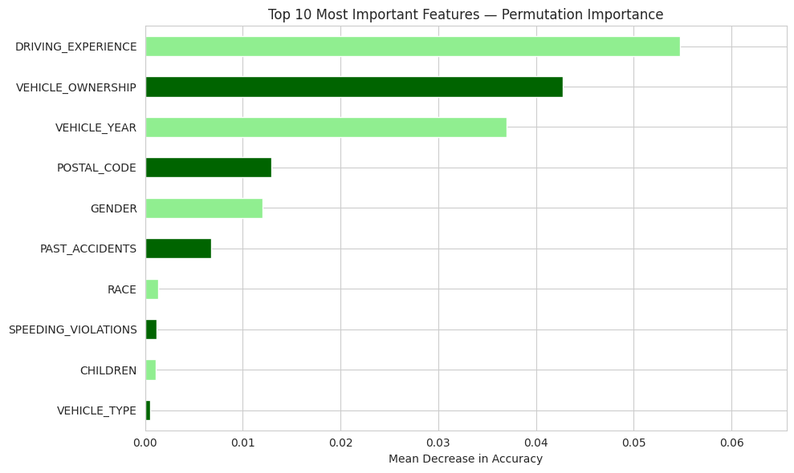

# 🚗 Car Insurance Claims Prediction


---

## 🔍 Problem Statement

Car insurance companies face significant financial risk when customers file unexpected claims.
Accurate prediction of claim likelihood enables smarter premium pricing and better risk management.

> **Goal:** Build a machine learning model that predicts whether a customer will file a car insurance claim —
> enabling insurers to identify high-risk customers **before** losses occur.

---

## 🎯 Target Variable

| Value | Meaning |
|-------|---------|
| `0` | Customer did NOT file a claim ✅ |
| `1` | Customer filed a claim ❌ |

**Claim Rate in Dataset: 31.33%**

---

## 📊 Dataset Overview

| Property | Value |
|----------|-------|
| Rows | 10,000 customers |
| Features | 18 input features + 1 target |
| Task | Binary Classification |

### Key Features

| Feature | Description |
|---------|-------------|
| `DRIVING_EXPERIENCE` | Years of driving experience |
| `VEHICLE_OWNERSHIP` | Owns or leases the vehicle |
| `VEHICLE_YEAR` | Before or after 2015 |
| `AGE` | Driver age group |
| `INCOME` | Income level |
| `EDUCATION` | Education level |
| `SPEEDING_VIOLATIONS` | Number of speeding tickets |
| `DUIS` | DUI incidents |
| `PAST_ACCIDENTS` | Previous accidents |

---

## ⚙️ Methodology

```
Data Loading → EDA → Feature Analysis → Preprocessing → Modeling → Evaluation → Insights
```
### Key Steps
- **EDA** — Explored claim rates across all demographic and behavioral features
- **Preprocessing** — StandardScaler + OneHotEncoder via ColumnTransformer
- **Modeling** — Random Forest Classifier with Permutation Importance analysis
- **Explanatory Analysis** — Deep dive into top predictive features

---

## 🔑 Key EDA Findings

### Claim Rate by Driving Experience


> Drivers with **0-9 years** of experience have a **62.8%** claim rate —
> nearly **double the average** of 31.3%.
> Expert drivers (30y+) have a claim rate of almost **0%**.

### Claim Rate by Gender


> Male drivers show a **36.3%** claim rate vs **26.4%** for female drivers —
> a 10% gap, making gender a statistically significant risk predictor.

---

## 📈 Visualizations

### Target Distribution


### Categorical Features vs Claim Rate


### Numerical Features vs Claim


### Top 10 Most Important Features — Permutation Importance


---

## 🤖 Model Results

### Random Forest — Default

| Dataset | Precision (0) | Recall (0) | Precision (1) | Recall (1) | Accuracy |
|---------|--------------|------------|--------------|------------|----------|
| Training | 1.00 | 1.00 | 1.00 | 1.00 | 1.00 |
| **Test** | **0.86** | **0.90** | **0.76** | **0.67** | **0.83** |

> ⚠️ Training accuracy = 1.00 indicates overfitting.
> Test performance is solid but has room for improvement on the minority class (claims).

---

## 🔑 Feature Importance — Top 10

| Rank | Feature | Importance |
|------|---------|-----------|
| 1 | `DRIVING_EXPERIENCE` | 0.062 |
| 2 | `VEHICLE_OWNERSHIP` | 0.053 |
| 3 | `VEHICLE_YEAR` | 0.042 |
| 4 | `POSTAL_CODE` | 0.031 |
| 5 | `GENDER` | 0.028 |
| 6 | `PAST_ACCIDENTS` | 0.024 |
| 7 | `RACE` | 0.008 |
| 8 | `SPEEDING_VIOLATIONS` | 0.007 |
| 9 | `CHILDREN` | 0.006 |
| 10 | `VEHICLE_TYPE` | 0.005 |

---

## 💡 Business Recommendations

### 1. 🎯 Prioritize Experience-Based Pricing
> Drivers with **less than 10 years** of experience have **2x the average** claim rate.
> Premium pricing should heavily weight driving experience as the #1 risk factor.

### 2. 🚗 Flag Pre-2015 Vehicle Owners
> Vehicles manufactured **before 2015** show significantly higher claim rates.
> Older vehicles may lack modern safety features — consider higher premiums for this group.

### 3. 👤 Refine Risk Profiles Using Behavioral Data
> `DRIVING_EXPERIENCE`, `VEHICLE_OWNERSHIP`, and `PAST_ACCIDENTS` together
> provide the strongest predictive signal.
> A combined behavioral risk score could replace broad demographic assumptions.

---

## 🛠️ Tech Stack

```python
pandas • numpy • matplotlib • seaborn • scikit-learn
```

---

## 📁 Project Structure

```
Car-Insurance-Claims-Prediction/
│
├── Projec_4_part_1.ipynb        ← Main notebook
├── README.md
└── images/
    ├── claim_distribution.png
    ├── categorical_claim_rates.png
    ├── numerical_features.png
    ├── permutation_importance.png
    ├── explanatory_viz_1.png
    └── gender_claim_rate.png
```

---

## 🚀 How to Run

```bash
git clone https://github.com/dohaalnabahin/Car-Insurance-Claims-Prediction
```

Then open `Projec_4_part_1.ipynb` in Google Colab or Jupyter Notebook.

---

*Built with ❤️ as part of a Data Science learning journey*
